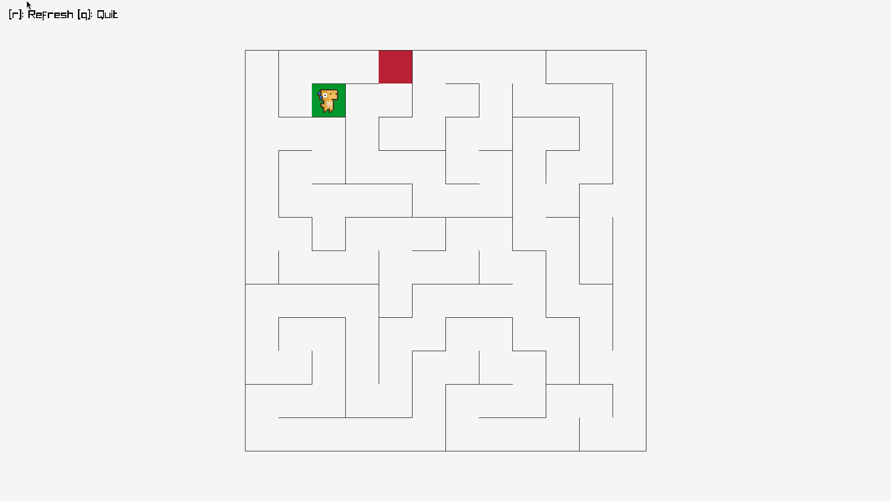

# zigi

A small maze game written in [Zig](https://ziglang.org/) using [raylib](https://www.raylib.com/) (via [raylib-zig](https://github.com/raylib-zig/raylib-zig)), built as a learning project.

A random maze is generated on each run. Guide your dino from the start to the end.



## Installation

### Manual

Requires Zig **0.16.0+**.

```bash
git clone https://codeberg.org/Iamlooker/zigi.git
cd zigi
zig build run
```

## Controls

| Key | Action |
| --- | ------ |
| `W` | Move up |
| `S` | Move down |
| `A` | Move left |
| `D` | Move right |
| `R` | Regenerate maze |
| `Q` | Quit |

## Credits

Dino character sprites by [Arks](https://arks.itch.io/dino-characters) ([@ArksDigital](https://twitter.com/ArksDigital)), licensed under [CC BY 4.0](https://creativecommons.org/licenses/by/4.0/). Files: [`resources/sprites/`](resources/sprites/) (unmodified).

Sound effects and music from [Pixabay](https://pixabay.com/), licensed under the [Pixabay Content License](https://pixabay.com/service/license-summary/):

- [`music.mp3`](resources/sfx/music.mp3) — [Musical retro chiptune ringtone](https://pixabay.com/sound-effects/musical-retro-chiptune-ringtone-32463/)
- [`retry.wav`](resources/sfx/retry.wav) — [Negative beeps](https://pixabay.com/sound-effects/film-special-effects-negative-beeps-6008/)
- [`move.wav`](resources/sfx/move.wav) — [Retro jump sound 04](https://pixabay.com/sound-effects/retro-jump-sound-04-474783/)
- [`ui.wav`](resources/sfx/ui.wav) (unused) — [UI click retro](https://pixabay.com/sound-effects/film-special-effects-ui-click-retro-514601/)
- [`jump.wav`](resources/sfx/jump.wav) (unused) — [Retro jump 3](https://pixabay.com/sound-effects/film-special-effects-retro-jump-3-236683/)

## License

Source code is licensed under [MIT](LICENSE). Assets under `resources/` are third-party — see [Credits](#credits) for their licenses.
